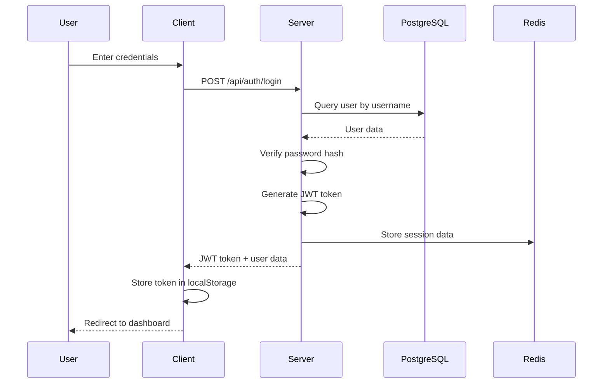
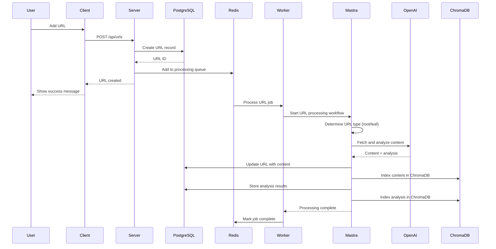
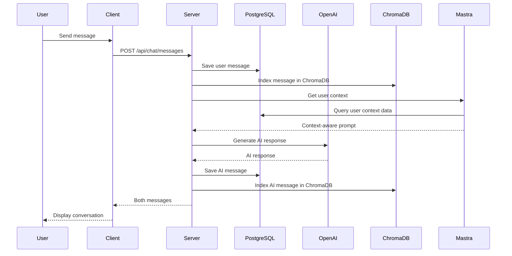
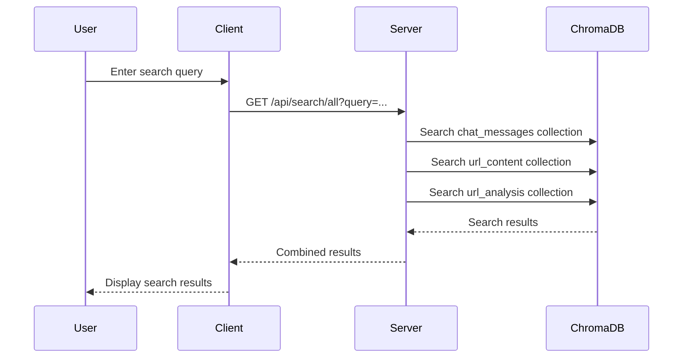
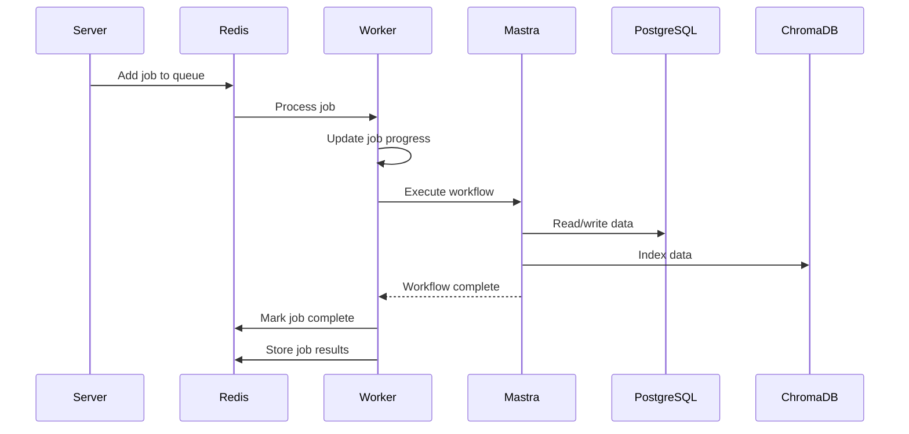

# ResearchBuddy Architecture

## Overview

ResearchBuddy is a full-stack research assistant application that combines AI-powered content analysis, vector search, and intelligent workflow management. The system is built with a microservices-inspired architecture using modern technologies for scalability and maintainability.

## System Architecture

```
┌─────────────────┐    ┌─────────────────┐    ┌─────────────────┐
│   React Client  │    │   Express API   │    │   Worker Process │
│                 │    │                 │    │                 │
│ • UI Components │◄──►│ • REST Endpoints│◄──►│ • Background    │
│ • State Mgmt    │    │ • Auth Middleware│    │   Processing    │
│ • Real-time UI  │    │ • Route Handler │    │ • Queue Workers │
└─────────────────┘    └─────────────────┘    └─────────────────┘
         │                       │                       │
         │                       │                       │
         ▼                       ▼                       ▼
┌─────────────────┐    ┌─────────────────┐    ┌─────────────────┐
│   ChromaDB      │    │   PostgreSQL    │    │     Redis       │
│   (Vector DB)   │    │   (Primary DB)  │    │   (Queue/Cache) │
│                 │    │                 │    │                 │
│ • Chat Messages │    │ • Users         │    │ • Job Queues    │
│ • URL Content   │    │ • URLs          │    │ • Session Store │
│ • URL Analysis  │    │ • Chat Messages │    │ • Rate Limiting │
└─────────────────┘    │ • Context Data  │    └─────────────────┘
                       └─────────────────┘
                                │
                                ▼
                       ┌─────────────────┐
                       │   Mastra AI     │
                       │   Framework     │
                       │                 │
                       │ • Workflows     │
                       │ • Agents        │
                       │ • Tools         │
                       └─────────────────┘
                                │
                                ▼
                       ┌─────────────────┐
                       │   External APIs │
                       │                 │
                       │ • OpenAI GPT-4o │
                       │ • Web Scraping  │
                       │ • RSS Feeds     │
                       └─────────────────┘
```

## Data Flow Diagrams

### 1. User Authentication Flow



### 2. URL Processing Flow



### 3. Chat Message Flow



### 4. Vector Search Flow



### 5. Background Processing Flow



## Component Details

### Frontend (React + TypeScript)

**Location**: `client/src/`

**Key Components**:
- `App.tsx` - Main application component
- `components/` - Reusable UI components
- `pages/` - Page-level components
- `hooks/` - Custom React hooks
- `lib/` - Utility functions and configurations

**State Management**:
- React Query for server state
- Local state for UI interactions
- Context for authentication

### Backend API (Express + TypeScript)

**Location**: `server/`

**Key Modules**:
- `index.ts` - Main server entry point
- `routes.ts` - API route definitions
- `auth.ts` - Authentication middleware
- `storage.ts` - Data access layer
- `chroma.ts` - ChromaDB integration
- `chroma-storage.ts` - Vector storage enhancement

**Middleware Stack**:
1. Security middleware (blocks suspicious requests)
2. Request logging
3. JSON parsing
4. Authentication (JWT)
5. Route handlers

### Worker Process (BullMQ + TypeScript)

**Location**: `server/worker.ts`

**Responsibilities**:
- Background URL processing
- Content analysis
- Queue management
- Progress tracking

**Queue Types**:
- `url-processing` - Process new URLs
- `content-analysis` - Analyze content

### Data Layer

#### PostgreSQL (Primary Database)

**Location**: `shared/schema.ts`

**Tables**:
- `users` - User accounts and authentication
- `urls` - Saved URLs and metadata
- `chat_messages` - Chat conversation history
- `leo_questions` - User questions and AI answers
- `user_contexts` - AI-generated user context
- `user_context_profiles` - Pro mode context profiles
- `context_urls` - Context-specific URLs
- `context_chat_messages` - Context-specific messages

#### ChromaDB (Vector Database)

**Location**: `server/chroma.ts`

**Collections**:
- `chat_messages` - Vector embeddings of chat messages
- `url_content` - Vector embeddings of URL content
- `url_analysis` - Vector embeddings of URL analysis

**Features**:
- Semantic search across all content
- User-isolated searches
- Metadata filtering
- Similarity scoring

#### Redis (Queue & Cache)

**Location**: `shared/redis.ts`

**Uses**:
- BullMQ job queues
- Session storage
- Rate limiting
- Temporary caching

### AI Framework (Mastra)

**Location**: `server/mastra/`

**Components**:
- **Workflows**: Orchestrate complex AI operations
  - `urlProcessingWorkflow` - Process URLs intelligently
  - `userContextWorkflow` - Generate user context
  - `weatherWorkflow` - Weather information

- **Agents**: AI-powered decision makers
  - `chatAgent` - Handle chat interactions
  - `contextAgent` - Manage user context
  - `urlProcessingAgent` - Process URLs
  - `weatherAgent` - Weather queries

- **Tools**: Specialized functions
  - `contextProfileTool` - Manage context profiles
  - `urlProcessingTool` - URL processing utilities
  - `weatherTool` - Weather data access

## Data Flow Patterns

### 1. Request-Response Pattern
- Standard HTTP requests for immediate operations
- Used for: Authentication, CRUD operations, search queries

### 2. Queue-Based Processing Pattern
- Asynchronous background processing
- Used for: URL processing, content analysis, heavy computations

### 3. Event-Driven Pattern
- Real-time updates and notifications
- Used for: Job progress updates, real-time chat

### 4. CQRS Pattern (Command Query Responsibility Segregation)
- Separate read and write operations
- Used for: Search vs. data modification

## Security Architecture

### Authentication
- JWT-based authentication
- Session management via Redis
- Password hashing with bcrypt

### Authorization
- Role-based access control (user/admin)
- User data isolation
- API endpoint protection

### Data Protection
- Input validation and sanitization
- SQL injection prevention (Drizzle ORM)
- XSS protection
- CSRF protection

## Scalability Considerations

### Horizontal Scaling
- Stateless API servers
- Redis-based session storage
- Queue-based background processing

### Database Scaling
- Connection pooling
- Read replicas (future)
- Database sharding (future)

### Caching Strategy
- Redis for session data
- Browser caching for static assets
- CDN for global distribution (future)

## Monitoring & Observability

### Logging
- Structured logging with Pino
- Request/response logging
- Error tracking and alerting

### Health Checks
- Database connectivity
- Redis connectivity
- ChromaDB health
- External API status

### Metrics
- Request latency
- Queue processing times
- Error rates
- User activity metrics

## Deployment Architecture

### Development
- Local PostgreSQL
- Local Redis
- ChromaDB Cloud
- Hot reloading

### Production
- Containerized deployment
- Load balancer
- Auto-scaling
- Database backups
- Monitoring and alerting

## Environment Configuration

### Required Environment Variables
```bash
# Database
DATABASE_URL=postgresql://...

# Redis
REDIS_URL=redis://...

# ChromaDB
CHROMA_API_KEY=...
CHROMA_TENANT=...
CHROMA_DATABASE=...

# OpenAI
OPENAI_API_KEY=...

# JWT
JWT_SECRET=...

# AWS S3 (optional)
AWS_ACCESS_KEY_ID=...
AWS_SECRET_ACCESS_KEY=...
AWS_REGION=...
S3_BUCKET=...
```

## Development Workflow

### Local Development
1. Clone repository
2. Install dependencies: `npm install`
3. Set up environment variables
4. Start database: `npm run db:setup`
5. Run migrations: `npm run db:migrate`
6. Start development server: `npm run dev`
7. Start worker: `npm run dev:worker`

### Testing
- Integration tests: `npm run chroma:test`
- Database tests: `npm run db:test-connection`
- API tests: Manual testing via frontend

### Deployment
1. Build application: `npm run build`
2. Run database migrations
3. Deploy to production environment
4. Monitor health checks
5. Verify functionality

## Future Enhancements

### Planned Features
- Real-time collaboration
- Advanced analytics dashboard
- Mobile application
- API rate limiting
- Advanced search filters
- Export functionality
- Integration with external tools

### Technical Improvements
- GraphQL API
- WebSocket real-time updates
- Microservices architecture
- Kubernetes deployment
- Advanced caching strategies
- Performance optimization 