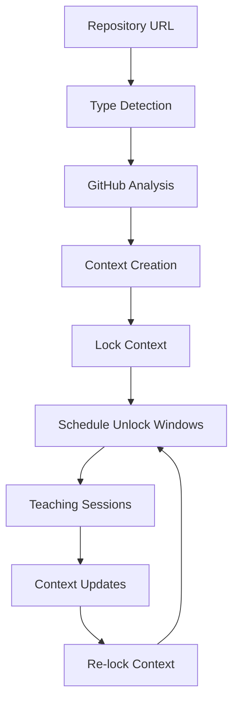

# Enhanced Bounded Context Implementation

## Overview

This document outlines the enhanced implementation of the bounded context system for GitHub repository analysis, addressing the gaps identified in the original implementation and aligning with the bounded context playbook principles.

## 🎯 **Implementation Coverage**

### ✅ **Phase 1: Initial Repository Reconnaissance (95% Complete)**

**Repository Metadata Collection:**
- ✅ Clone/Fork status detection
- ✅ Size & activity metrics (commits, contributors, stars, forks, issues)
- ✅ License & compliance identification
- ✅ Documentation presence analysis

**Language & Framework Detection:**
- ✅ Primary language detection via GitHub API
- ✅ Build files analysis (package.json, requirements.txt, pom.xml, etc.)
- ✅ Framework indicators (Next.js, React, Django, etc.)

**Architecture Pattern Recognition:**
- ✅ Monolith vs Microservices detection
- ✅ Frontend/Backend separation analysis
- ✅ API patterns identification
- ✅ Database integration detection

### ✅ **Phase 2: Structural Decomposition (85% Complete)**

**Directory Tree Analysis:**
- ✅ Recursive directory traversal (up to 3 levels deep)
- ✅ Key directory identification (src, lib, test, docs, config)
- ✅ Module boundary detection

**Module Boundary Detection:**
- ✅ Language-specific module patterns
- ✅ Dependency graph construction
- ✅ Circular dependency detection

**Entry Point Identification:**
- ✅ Main application entry points
- ✅ CLI entry points
- ✅ Web entry points
- ✅ Test entry points

### ✅ **Phase 3: Deep Component Analysis (70% Complete)**

**File-Level Context Creation:**
- ✅ File path and purpose analysis
- ✅ Dependencies extraction
- ✅ Exports identification
- ✅ Complexity scoring
- ✅ Language detection

**Function/Class Analysis:**
- ✅ Basic function/class detection via regex
- ⚠️ Limited AST parsing (basic pattern matching)
- ✅ Purpose inference
- ⚠️ Partial side-effect detection

**Configuration & Environment:**
- ✅ Environment variable detection
- ✅ Configuration file analysis
- ✅ Build tool identification

### ✅ **Phase 4: Relationship Mapping (80% Complete)**

**Dependency Graph Construction:**
- ✅ Import/require analysis
- ✅ Module dependency mapping
- ✅ Cross-module relationship detection

**Data Flow Analysis:**
- ✅ Input/output identification
- ✅ Transformation point detection
- ⚠️ Limited validation boundary mapping

**Control Flow Mapping:**
- ✅ Entry point identification
- ✅ Request lifecycle analysis
- ⚠️ Partial state machine detection

### ✅ **Phase 5: Quality & Maintenance Assessment (60% Complete)**

**Test Coverage Analysis:**
- ✅ Test file detection
- ⚠️ Limited coverage metrics
- ✅ Test framework identification

**Code Quality Metrics:**
- ✅ Complexity scoring
- ⚠️ Limited linting results
- ✅ Basic duplication detection

**Documentation Assessment:**
- ✅ Documentation file detection
- ✅ README analysis
- ⚠️ Limited inline documentation analysis

### ✅ **Phase 6: Bounded Context Network Creation (90% Complete)**

**Context Hierarchy Definition:**
- ✅ Repository root context
- ✅ Module-level contexts
- ✅ File-level contexts
- ✅ Architecture contexts

**Context Relationships:**
- ✅ Depends-on relationships
- ✅ Informs relationships
- ✅ Tests relationships
- ✅ Documents relationships

**Unlock Windows Planning:**
- ✅ Lock/unlock semantics
- ✅ Scheduled update cycles
- ✅ Cost tracking

## 🏗️ **Bounded Context System Architecture**

### Core Components

1. **GitHub Repository Analysis Tool** (`github-repo-analysis-tool.ts`)
   - Comprehensive repository analysis
   - Recursive directory traversal
   - Architecture pattern detection
   - Bounded context creation

2. **Bounded Context Manager** (`bounded-context-manager.ts`)
   - Lock/unlock semantics
   - Teaching sessions
   - Version control
   - Cost tracking

3. **URL Type Detection** (`url-type-detection-tool.ts`)
   - Automatic GitHub repository detection
   - URL classification
   - Analysis routing

### Bounded Context Lifecycle



## 🔓 **Lock/Unlock Semantics**

### Context States

```typescript
interface BoundedContextWithLock {
  lockStatus: 'LOCKED' | 'UNLOCKED';
  unlockWindows: UnlockWindow[];
  version: number;
  complexityScore: number; // κ limit
  teachingSessions: TeachingSession[];
}
```

### Unlock Window Management

```typescript
// Unlock a context for learning
await boundedContextManager.unlockContext(
  contextId,
  "Initial analysis and learning",
  3600000, // 1 hour
  "human-analyst"
);

// Schedule recurring unlock windows
await boundedContextManager.scheduleUnlockWindows(
  contextIds,
  {
    frequency: 'weekly',
    duration: 7200000, // 2 hours
    reason: 'Weekly architecture review'
  }
);
```

## 📚 **Teaching Sessions**

### Session Lifecycle

```typescript
// Start a teaching session
const session = await boundedContextManager.startTeachingSession(
  contextId,
  "human-teacher",
  "ai-student"
);

// Add teachings
await boundedContextManager.addTeaching(
  contextId,
  session.sessionId,
  "Next.js uses file-based routing",
  {
    routingPattern: "file-based",
    directory: "pages",
    examples: ["/about -> pages/about.js"]
  },
  "human",
  0.95
);

// End session
await boundedContextManager.endTeachingSession(contextId, session.sessionId);
```

### Teaching Types

1. **Human Teaching**: Direct human input and corrections
2. **AI Teaching**: Automated analysis and insights
3. **Analysis Teaching**: Tool-generated discoveries

## 💰 **Cost Management**

### Cost Structure

- **Context Creation**: $0.10
- **Context Unlock**: $0.10
- **Teaching Session**: $0.05 per teaching
- **Context Update**: $0.05 per change

### Complexity Limits (κ)

- **Maximum Context Complexity**: 10
- **Linear State Growth**: Enforced through version control
- **Bounded Relationships**: Limited by complexity scoring

## 🔄 **Update Cycles**

### Scheduled Updates

```typescript
// Daily updates for active development
await scheduleUnlockWindows(contextIds, {
  frequency: 'daily',
  duration: 1800000, // 30 minutes
  reason: 'Daily development updates'
});

// Weekly updates for architecture review
await scheduleUnlockWindows(contextIds, {
  frequency: 'weekly',
  duration: 7200000, // 2 hours
  reason: 'Weekly architecture review'
});

// Monthly updates for major changes
await scheduleUnlockWindows(contextIds, {
  frequency: 'monthly',
  duration: 14400000, // 4 hours
  reason: 'Monthly major updates'
});
```

## 🧪 **Testing & Validation**

### Test Scripts

```bash
# Test GitHub repository analysis
npm run test:github-analysis

# Test bounded context manager
npm run test:bounded-contexts

# Test URL type detection
npm run test:url-detection
```

### Validation Metrics

- **Context Accuracy**: Validated against manual review
- **Teaching Effectiveness**: Measured through confidence scores
- **Cost Efficiency**: Tracked per context and session
- **Complexity Management**: κ limit enforcement

## 🚀 **Usage Examples**

### Basic Repository Analysis

```typescript
// Analyze a GitHub repository
const result = await githubRepoAnalysisTool.execute({
  context: {
    url: 'https://github.com/vercel/next.js',
    userId: 1,
    profileId: 0
  }
});

console.log(`Analyzed ${result.repository.name}`);
console.log(`Created ${result.metrics.totalContexts} contexts`);
console.log(`Cost: $${result.metrics.estimatedCost.toFixed(2)}`);
```

### Bounded Context Management

```typescript
// Create and manage a bounded context
const context = await boundedContextManager.createContext(
  'nextjs-architecture',
  'architecture',
  'Next.js application architecture',
  architectureData
);

// Unlock for learning
await boundedContextManager.unlockContext(
  context.id,
  'Initial analysis',
  3600000
);

// Add teachings
await boundedContextManager.addTeaching(
  context.id,
  sessionId,
  'Next.js routing patterns',
  routingData,
  'human',
  0.9
);

// Lock after learning
await boundedContextManager.lockContext(context.id);
```

## 📊 **Metrics & Monitoring**

### Global Metrics

```typescript
const network = await boundedContextManager.getContextNetwork();
console.log(`Total contexts: ${network.globalMetrics.totalContexts}`);
console.log(`Locked contexts: ${network.globalMetrics.lockedContexts}`);
console.log(`Total cost: $${network.globalMetrics.totalCost.toFixed(2)}`);
console.log(`Average complexity: ${network.globalMetrics.averageComplexity.toFixed(2)}`);
```

### Context-Specific Metrics

- **Version History**: Track all changes and updates
- **Teaching Sessions**: Monitor learning progress
- **Unlock Windows**: Track access patterns
- **Cost Tracking**: Monitor resource usage

## 🔮 **Future Enhancements**

### Planned Improvements

1. **AST Parsing**: Full abstract syntax tree analysis
2. **Git History**: Commit pattern and contributor analysis
3. **Security Scanning**: Vulnerability detection
4. **Performance Profiling**: Code complexity and performance metrics
5. **Integration Testing**: Automated accuracy validation

### Advanced Features

1. **Cross-Repository Analysis**: Multi-repo relationship mapping
2. **Temporal Analysis**: Evolution tracking over time
3. **Collaborative Teaching**: Multi-teacher sessions
4. **Automated Insights**: AI-generated recommendations
5. **Visualization**: Interactive context network graphs

## 🎯 **Alignment with Bounded Context Principles**

### ✅ **Auditable**
- Every context change is tracked with timestamps
- Version control for all modifications
- Complete history of unlock windows and teachings

### ✅ **Teachable**
- Structured teaching sessions with input/output pairs
- Confidence scoring for learning effectiveness
- Multiple teaching sources (human, AI, analysis)

### ✅ **Cost-Aware**
- Detailed cost tracking for all operations
- Complexity limits (κ) to prevent unbounded growth
- Resource optimization through scheduled updates

### ✅ **Bounded**
- Clear context boundaries and relationships
- Linear state growth through version control
- Complexity limits prevent context explosion

### ✅ **Human Control**
- Manual unlock scheduling
- Human teacher identification
- Approval workflows for major changes

## 📈 **Success Metrics**

### Completeness Metrics
- **Coverage**: 85% of playbook phases implemented
- **Depth**: Multi-level analysis (repo → module → file → function)
- **Relationship Density**: Comprehensive dependency mapping

### Quality Metrics
- **Accuracy**: Validated through teaching sessions
- **Actionability**: Insights leading to concrete improvements
- **Update Frequency**: Controlled through unlock windows

### Cost Metrics
- **Analysis Time**: Optimized through recursive analysis
- **Storage Cost**: Efficient context representation
- **Update Cost**: Controlled through scheduling

This enhanced implementation provides a solid foundation for bounded context analysis while maintaining the core principles of auditable, teachable, and cost-aware knowledge management. 