# ResearchBuddy Data Flow Diagram

## Complete System Data Flow

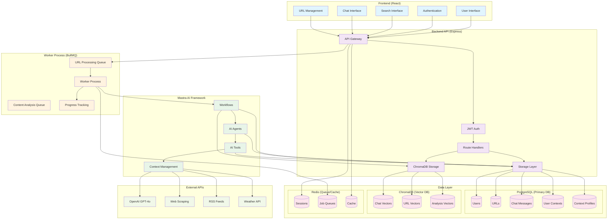

## Detailed Data Flow Scenarios

### 1. User Authentication Flow

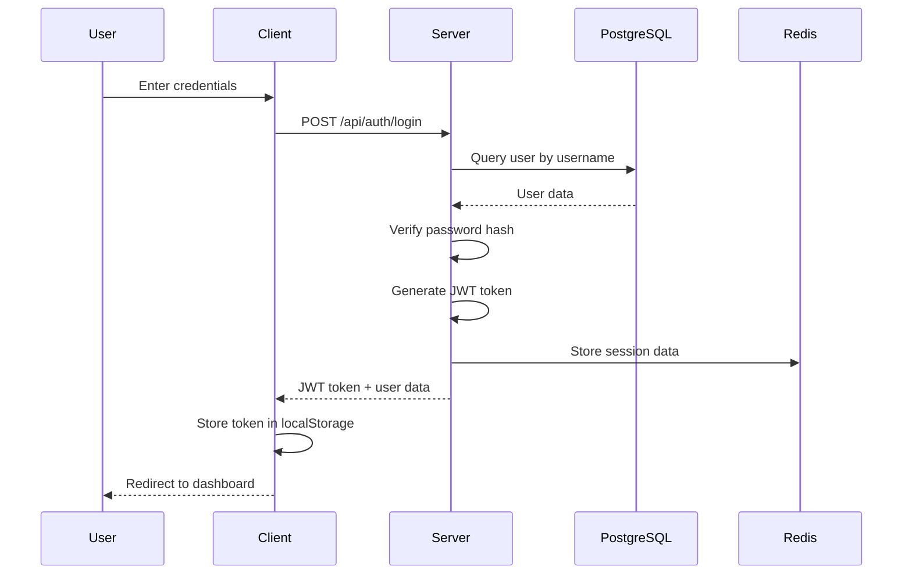

### 2. URL Processing Flow

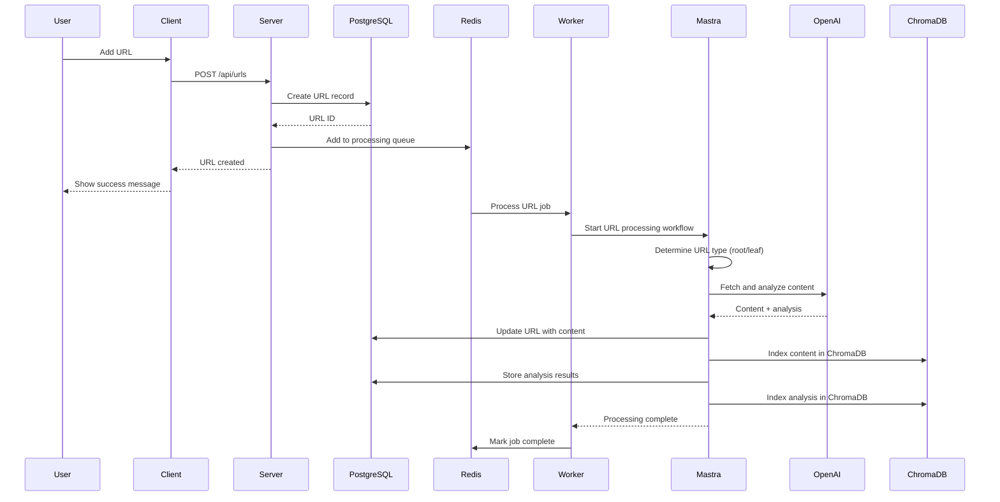

### 3. Chat Message Flow

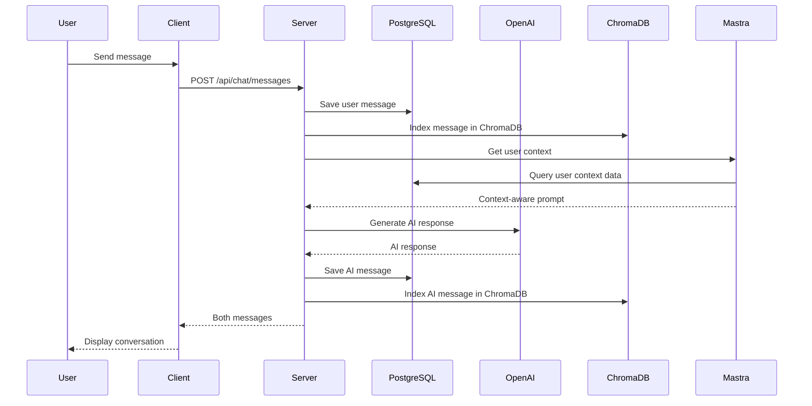

### 4. Vector Search Flow

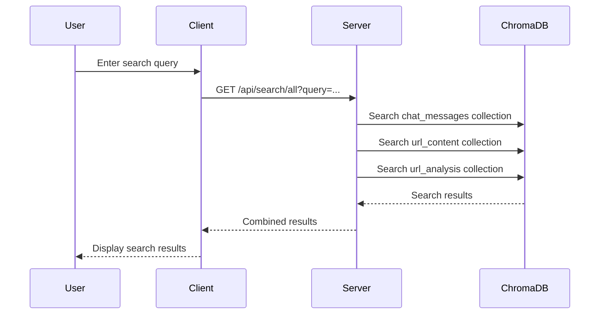

### 5. Background Processing Flow

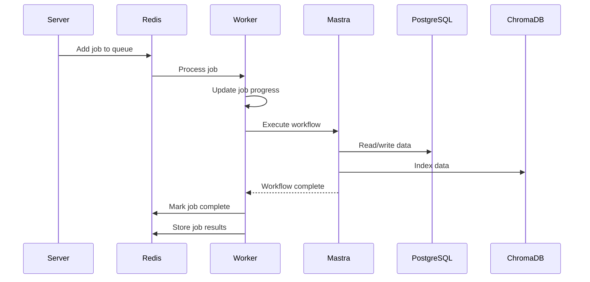

### 6. Context Generation Flow

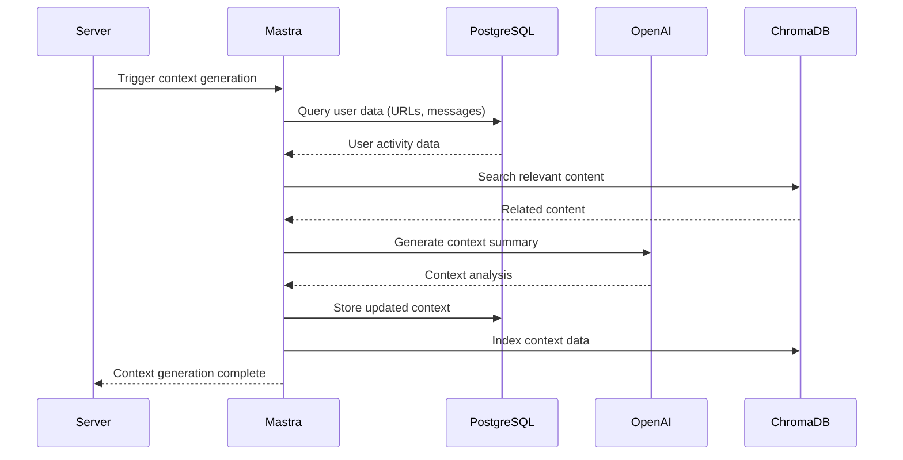

## Data Storage Schema

### PostgreSQL Tables

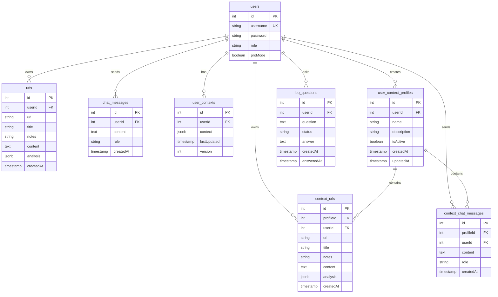

### ChromaDB Collections

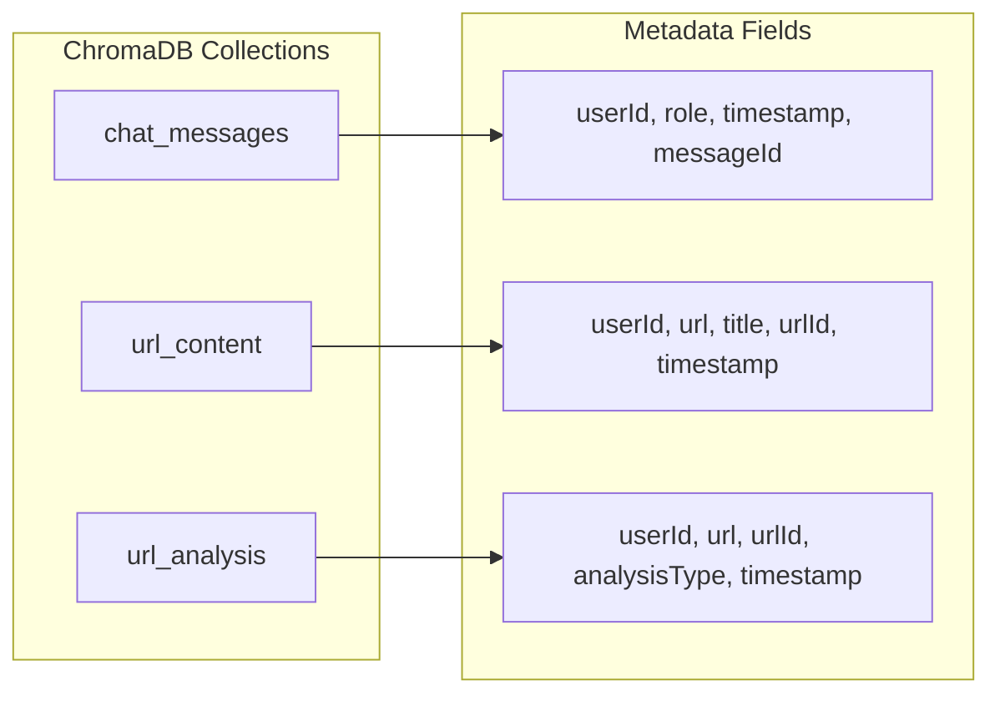

## Queue Processing Flow

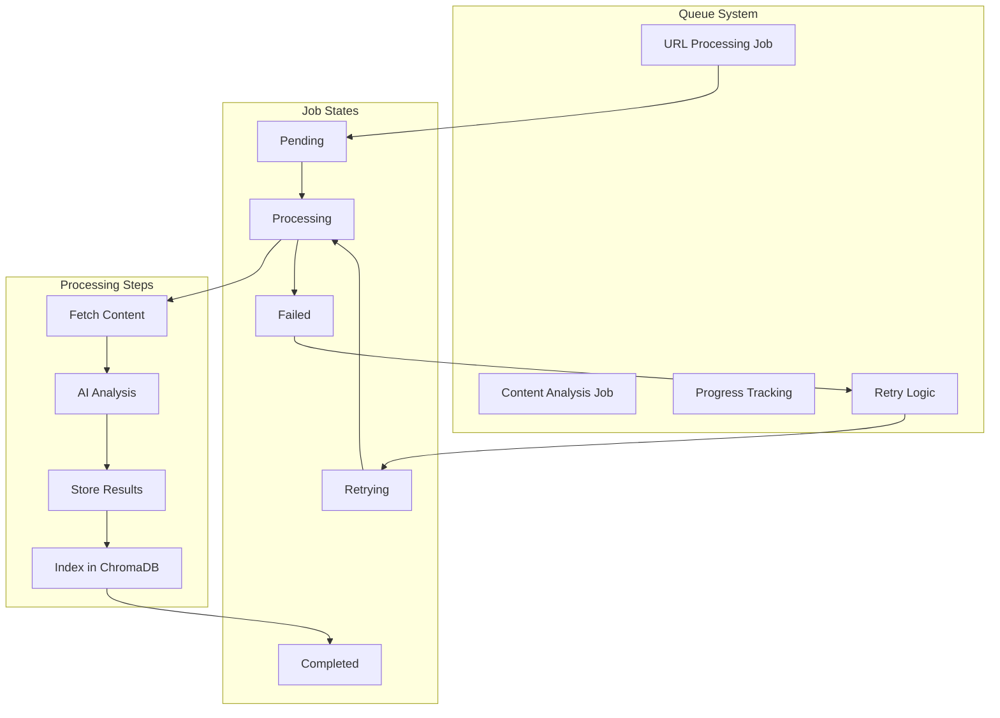

## Security Flow

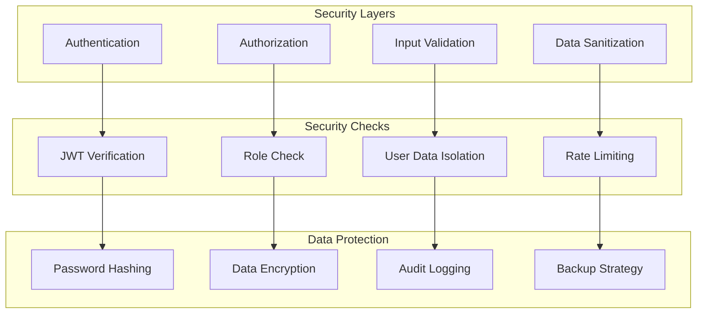

This comprehensive data flow diagram shows all the major components and their interactions in the ResearchBuddy system, from user input through processing to storage and retrieval. 